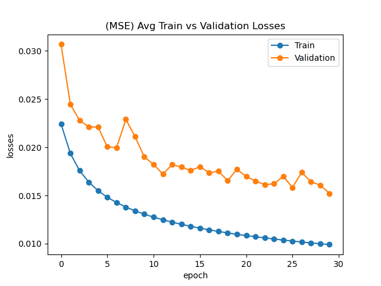
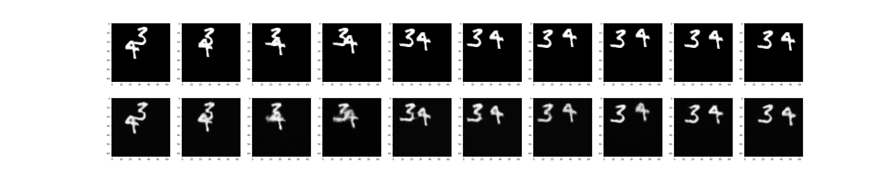
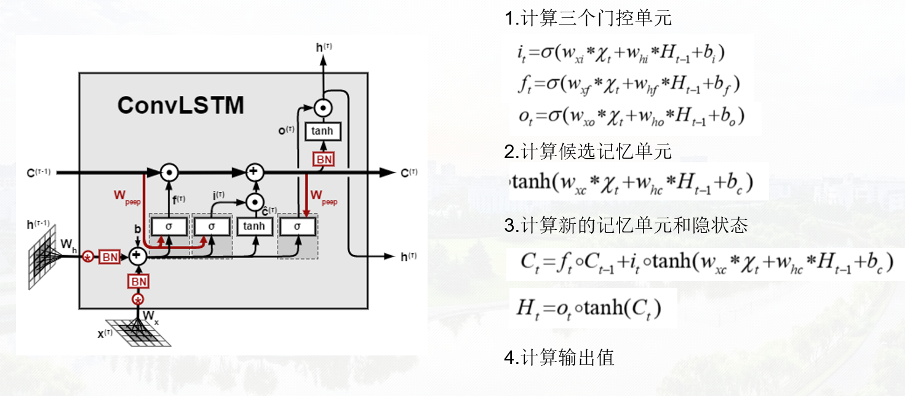
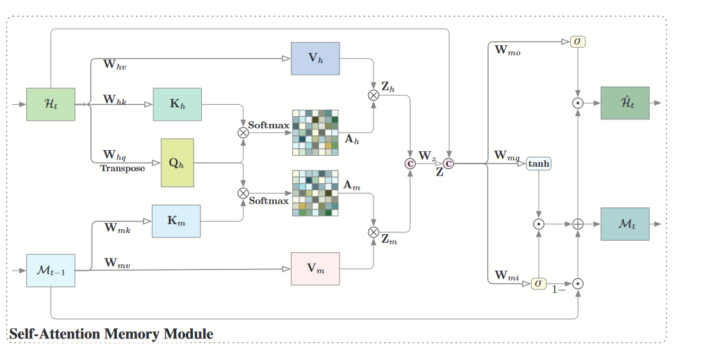
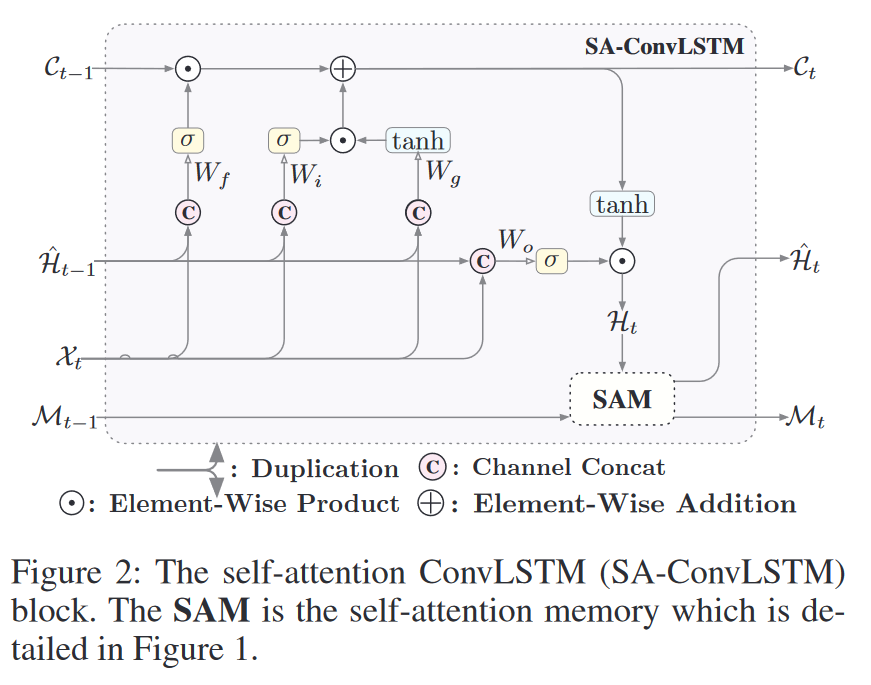
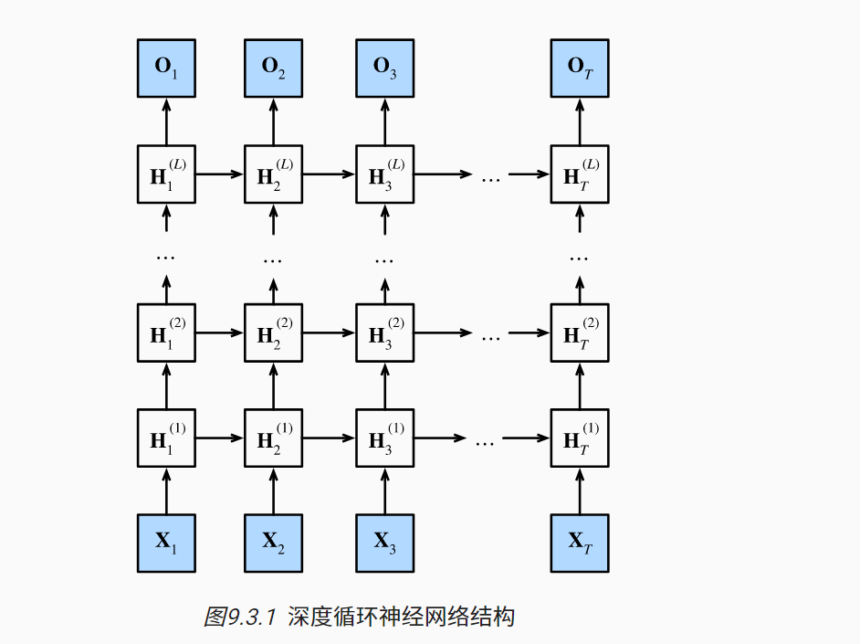

# implement  self-attention convolution LSTM

## Requirements

```
    torch==1.8.1
    torchvision==0.9.1
    numpy==1.19.5
    matplotlib==3.4.1
```

## Getting Started

```
    git clone https://github.com/CaiCandong/sa_convLSTM.git
    cd sa_convLSTM
    python train.py
```

## Results

| 模型 | 训练集loss | 验证集loss |
| :-----| ----: | :----: |
| SA-ConvLSTM | 0.0136 | 0.0189|




# Model Architecture
## ConvLSTM



## SA-ConvLSTM Momory Module



## SA-ConvLSTM Architecture



## Multi-Layer SA-ConvLSTM Architecture



# References:

- https://github.com/MinNamgung/sa_convlstm
- https://github.com/hyona-yu/SA-convlstm
- Lin, Zhihui,. [《Self-Attention ConvLSTM for Spatiotemporal Prediction》](https://ojs.aaai.org/index.php/AAAI/article/view/6819)
- https://github.com/jerrywn121/TianChi_AIEarth/tree/main/SAConvLSTM
