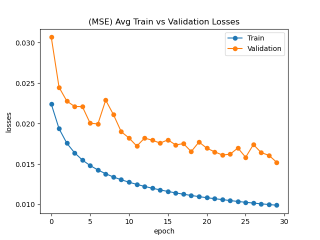
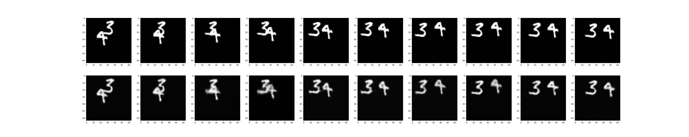
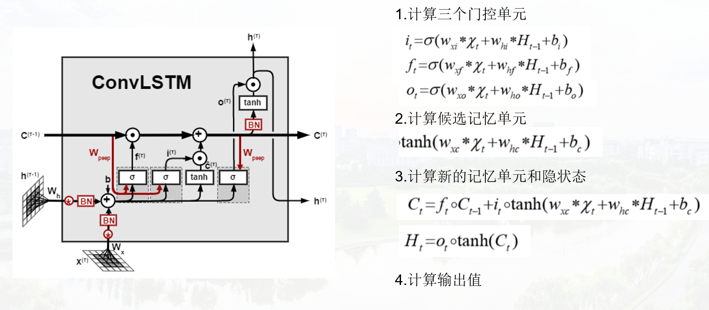
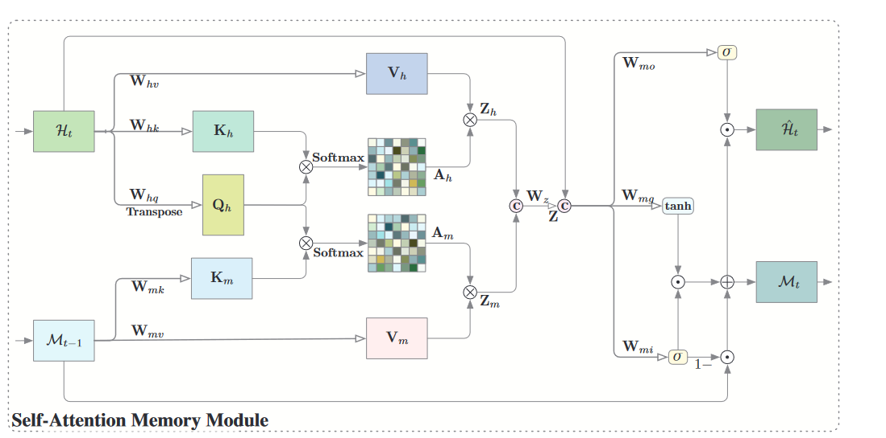
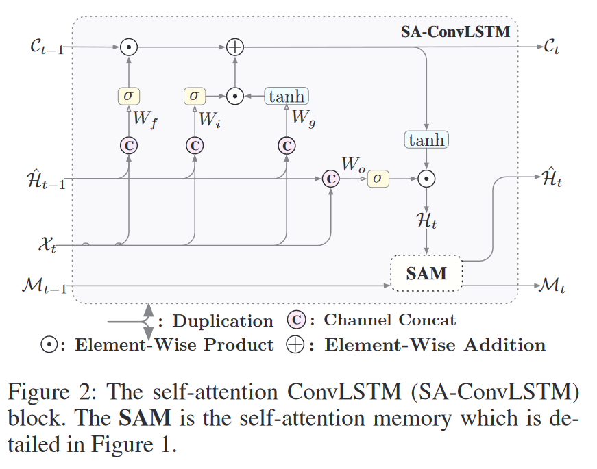
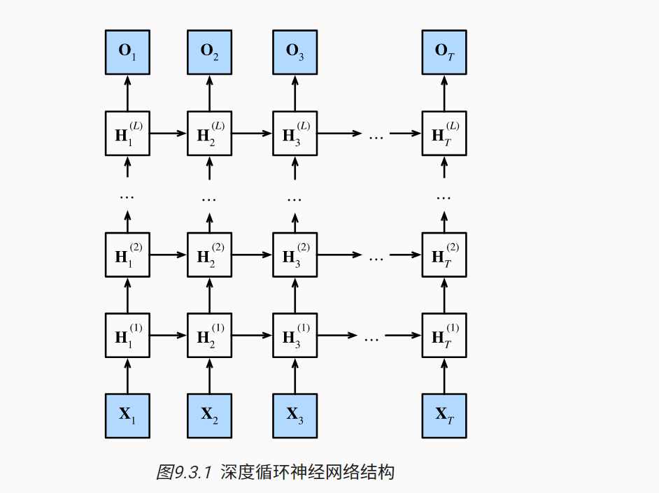

# implement  self-attention convolution LSTM

# 代码实验效果 
train loss 0.013609007415620404   
valid loss 0.01899987788250049    

   
  

## Conv LSTM

## self-attention ConvLSTM momory module

## self-attention ConvLSTM Arch

## 多层堆叠

References:

- https://github.com/MinNamgung/sa_convlstm
- https://github.com/hyona-yu/SA-convlstm
- Lin, Zhihui,. [《Self-Attention ConvLSTM for Spatiotemporal Prediction》](https://ojs.aaai.org/index.php/AAAI/article/view/6819)
- https://github.com/jerrywn121/TianChi_AIEarth/tree/main/SAConvLSTM
